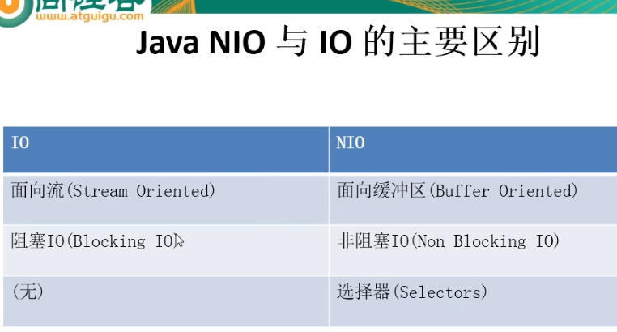
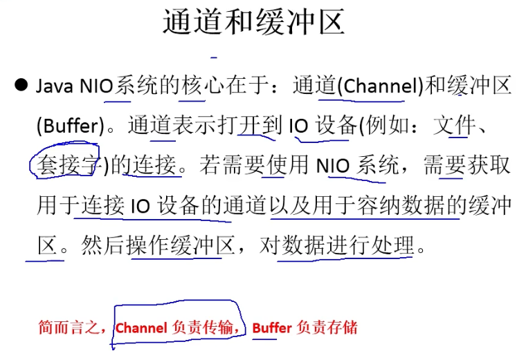
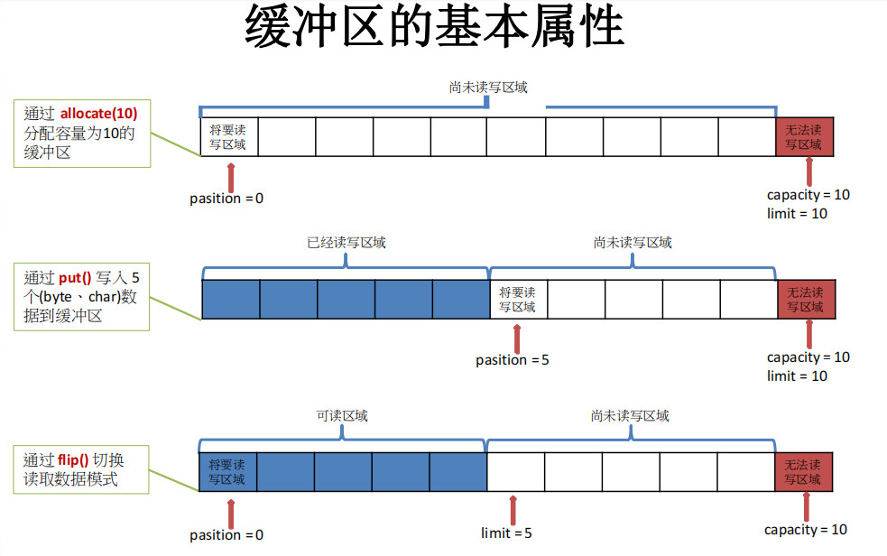
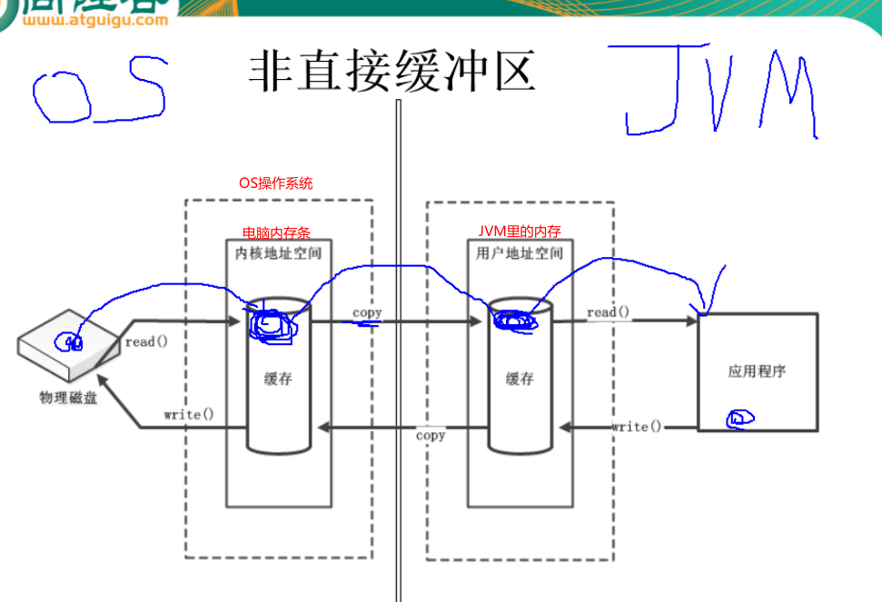
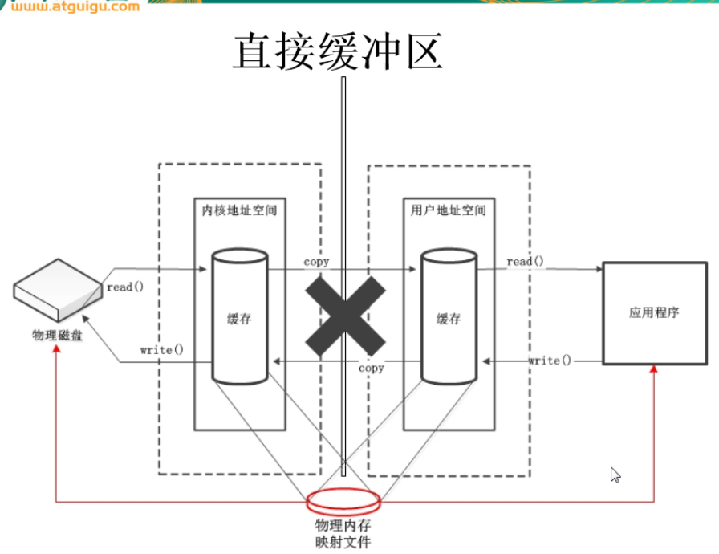

### 1，NIO与IO的区别

IO : 相当于在水厂(磁盘数据、网络数据等)和用户(程序)之间建立一个水管，通过水管传水，有输入输出流，流是单向的。

NIO : 相当于铁轨在仓库( 磁盘数据)和城市(程序)，铁轨本身不传输数据，靠火车车厢(缓冲区)来传输数据。

​         NIO缓冲区底层就是数组。

NIO传输的原理

### 2, 通道和缓冲区

### 3, 非直接缓冲区

传统的IO, 以及NIO的allocate(1024)方法是在JVM种开辟一块缓冲区，底层实际是在堆内存中

而NIO的allocatiDirect(..)方法是在物理内存中直接开辟一块缓冲区，有点是块，缺点耗费资源

### 4,通道示意图

