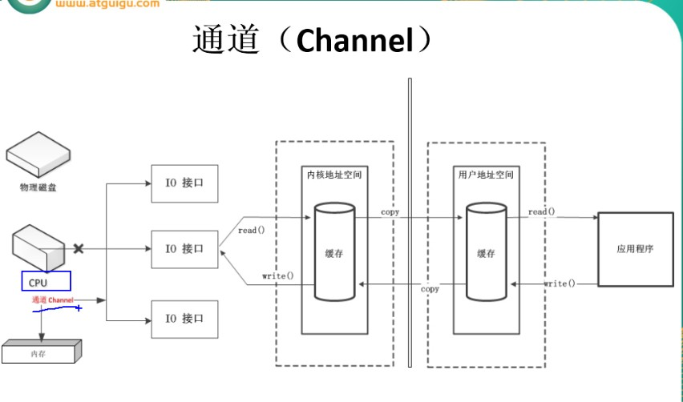

学习NIO之后可学习Socket和 Netty

### 1，NIO与IO的区别

IO : 相当于在水厂(磁盘数据、网络数据等)和用户(程序)之间建立一个水管，通过水管传水，有输入输出流，流是单向的。

NIO : 相当于铁轨在仓库( 磁盘数据)和城市(程序)，铁轨本身不传输数据，靠火车车厢(缓冲区)来传输数据。

​         NIO缓冲区底层就是数组。

NIO传输的原理

### 2, 通道和缓冲区

### 3, 非直接缓冲区

传统的IO, 以及NIO的allocate(1024)方法是在JVM种开辟一块缓冲区，底层实际是在堆内存中。

而NIO的allocatiDirect(..)方法是在物理内存中直接开辟一块缓冲区，优点是读写速度快，缺点耗费资源；

并不是直接的缓冲区一定好，根据实际情况来确定用哪种。

### 4,通道示意图

一，最早的IO通信是IO接口直接和CPU交互，CPU既要保存数据，还要开辟线程进行数据传输

二，Java老的IO流引入了DMA(Direct Memory Access)

**什么是DMA?**

DMA机制，允许硬盘（或者其它外设）中的数据直接传输到内存中，DMA允许硬盘，显卡，网卡等可以共享和获得内存中的数据，而不需要CPU的参与，减少了CPU的占用，使其能处理其它事情。

如果没有DMA的话，像上面第一种方式，硬盘或其它设备中的数据直接请求CPU，CPU再把数据放到内存，这期间就会被占用不能处理其它事情了，DMA就是直接硬盘中的数据放到内存，减少了CPU的工作，CPU直接从内存拿数据进行处理就行了。

参考：https://www.techtarget.com/whatis/definition/Direct-Memory-Access-DMA

三，Java 的NIO引入了Channel通道

通道类似于原来IO流的通道，本身没有存储数据，只是传输缓冲区中的数据。

跟铁轨的作用一样，传送车厢，车厢中存有货物。

